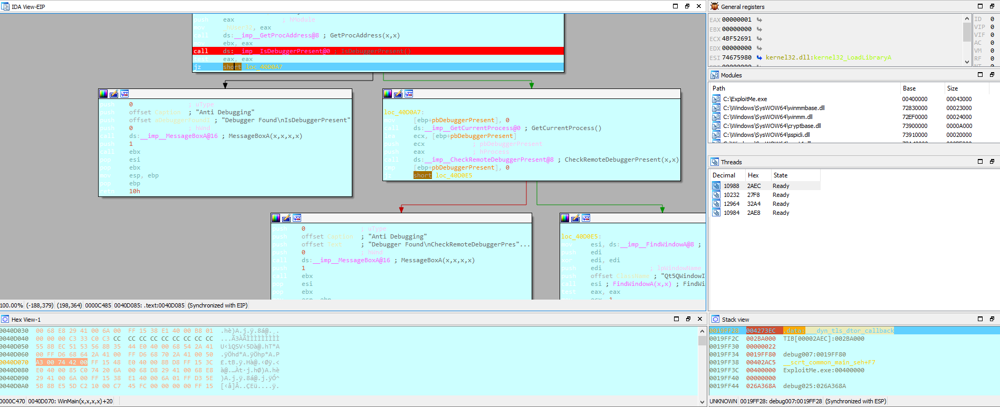
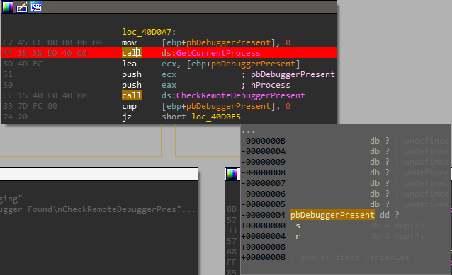

# ExploitMe
##  Nedir ?

**Exploit development** ve **reverse engineering** gibi ciddi konuların Türkçe kaynak sıkıntısını bir nebze olsun iyleştirebilmek ve meraklıları için eğitici bir projedir. Bu proje **Windows** tabanlı zafiyetlerin nasıl sömürüleceği ve bazı **anti-debugging** tekniklerinin nasıl aşılacağını anlatmayı hedeflemektedir. 


Projenin anlaşılabilir olması için;

1. Temel C ve Assembly Programlama Bilgisi
2. WinApi Fonksiyonlarıyla Çalışmış Olmak
3. Windows mimarisi hakkında az çok bilgi sahibi
4. Debuggerlarla vakit geçirmiş

Olmanız projenin anlaşılabilirliğini ileri seviye arttırmaktadır. Yukarıdaki gereksinimlere sahip olmayan kişiler bazı kısım/konuları anlamakta zorluk çekebilirler.


#### İçerik

* <span style="color:red">**Anti-Debugging**</span>
	1. **IsDebuggerPresent** Fonksiyonu ve Bypass Tekniği
	2. **CheckRemoteDebuggerPresent** Fonksiyonu ve Bypass Tekniği
	3. **FindWindow** Fonksiyonu İle Debugger Avı ve Bypass Tekniği
	4. **PEB & NtGlobalFlag** ve Bypass Tekniği

* <span style="color:red">**Exploit Development**</span>
	1. **Stack Overflow** Zafiyeti ve Sömürülmesi
	2. **Heap Overflow** Zafiyeti ve Sömürülmesi
	3. **Integer Overflow** Zafiyeti ve Sömürülmesi
	4. **Format String** Zafiyeti ve Sömürülmesi


## Anti-Debugging

#### **IsDebuggerPresent** Fonksiyonu ve Bypass Tekniği

[IsDebuggerPresent MSDN](https://msdn.microsoft.com/en-us/library/windows/desktop/ms680345(v=vs.85).aspx)

```c
BOOL WINAPI IsDebuggerPresent(void);
``` 

*IsDebuggerPresent* fonksiyonunun prototipi yukarıdaki gibidir. Bu fonksiyon bir uygulamanın debugger ile çalıştırılıp çalıştırılmadığını kontrol eder. Bu işi **PEB** yapısındaki **BeingDebugged** kontrol ederek gerçekleştirir.

**PEB Structure**

```c
typedef struct _PEB {
  BYTE                          Reserved1[2];
  BYTE                          BeingDebugged; // <---
  BYTE                          Reserved2[1];
  PVOID                         Reserved3[2];
  PPEB_LDR_DATA                 Ldr;
  PRTL_USER_PROCESS_PARAMETERS  ProcessParameters;
  BYTE                          Reserved4[104];
  PVOID                         Reserved5[52];
  PPS_POST_PROCESS_INIT_ROUTINE PostProcessInitRoutine;
  BYTE                          Reserved6[128];
  PVOID                         Reserved7[1];
  ULONG                         SessionId;
} PEB, *PPEB;
``` 

Bu fonksiyon uygulamamızın başlangıcında çalışıyor ve uygulamamız bir debuggerda çalışıyorsa hata mesajı verip sonlanıyor.


Uygulamamızı bir debugger yardımı ile açıp **IsDebuggerPresent** fonksiyonun geçelim. Alttaki resimde **IsDebuggerPresent** fonksiyonu çalışmış ve hata mesajı verip sonlanıcaktır. **IsDebuggerPresent** fonksiyonu çalıştığında sonucu **EAX** registerine yazmakta ve **JZ (Jump Zero)** instructionu ile gerekli yere zıplamakta. 




Yukarıda bahsettiğimiz gibi **IsDebuggerPresent** fonksiyonu return değerini **EAX** registerine yazmakta. Bu fonksiyonu bypass etmek için **EAX == 0x0** koşulu **sağlanmalıdır.** 


#### **CheckRemoteDebuggerPresent** Fonksiyonu ve Bypass Tekniği

[CheckRemoteDebuggerPresent MSDN](https://msdn.microsoft.com/en-us/library/windows/desktop/ms679280(v=vs.85).aspx)

```c
BOOL WINAPI CheckRemoteDebuggerPresent(
  _In_    HANDLE hProcess,
  _Inout_ PBOOL  pbDebuggerPresent
);
```

**CheckRemoteDebuggerPresent** fonksiyonu tıpkı **IsDebuggerPresent** fonksiyonuna benzemektedir ve prototipi yukarıdaki gibidir. Bu fonksiyonun **IsDebuggerPresent** fonksiyonundan tek farkı debug portuna bağlı bir hata ayıklama olup olmadığını kontrol etmek. Debug portlar tıpkı TCP/UDP portlarına benzemektedir. Bu porta bağlı bir debugger var ise farklı bir debugger bu processi attach edemez. Bazı uygulamaların birden fazla debug portu olabilir. Debug portu **EPROCESS** struct yapısında bulunmaktadır.
```cpp
	 // snipped
     PVOID DebugPort;
     union
     {
          PVOID ExceptionPortData;
          ULONG ExceptionPortValue;
          ULONG ExceptionPortState: 3;
     };
     // snipped
```


 MSDN sayfasından baktığınız zaman fonksiyon başarılı bir şekilde çalıştığı zaman nonzero bir değer döndürüyor. Yani **IsDebuggerPresent** fonksiyonu gibi **EAX** registerindaki değerle oynamamız yeterli olmuyor. Değeri memoryden değiştirmemiz gerekiyor. 


```c
if(ChckRmtDbgPrsnt) => True => Non Zero Value => Debugger Found!
if(ChckRmtDbgPrsnt) => False=> Zero => No Debugger Found!
```

Bu fonksiyon uygulamamızda şu şekilde kullanılmıştır.



Breakpointi koyup uygulamamızın istediğimiz yere kadar çalışması ve breakpointten sonra kontrolü elimize alıp bellekten **pbDebuggerPresent** in değerini değiştirdiğimizde bu fonksiyonuda bypass etmiş olacağız. 


Gördüğünüz gibi fonksiyonumuz başarı ile çalıştı ve **EAX** regiterina geri dönüş değerini yazdı. Memoryde değiştirmemiz gereken kısım ise şurada.

**debug007:0019FF30 db    1** değerin bir olduğunu görüyoruz bunu sıfıra çekmemiz gerekiyor. **0019FF30** kopyalayıp IDA Pro'da **Hex View** penceresinden **G** tuşuna basarak kopyaladığımız adrese zıplayıp **F2** tuşu ile editleyip fonksiyonumuzu bypass ediyoruz.

